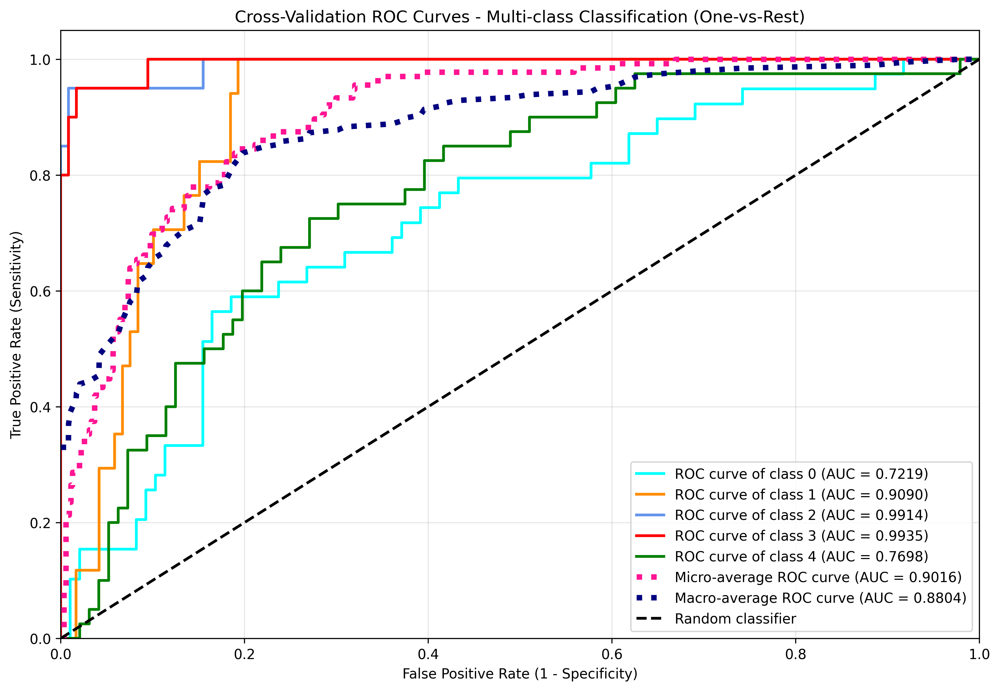
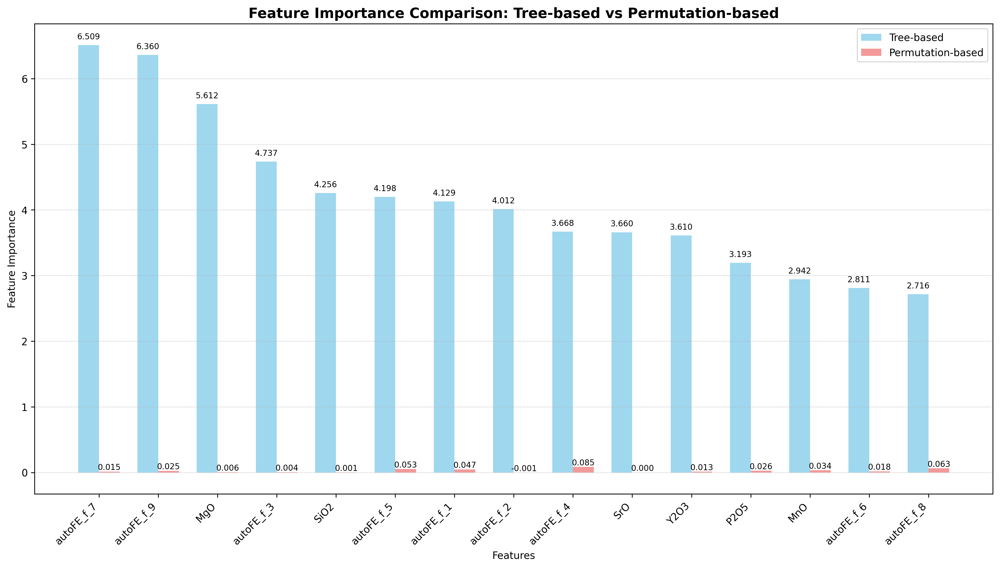
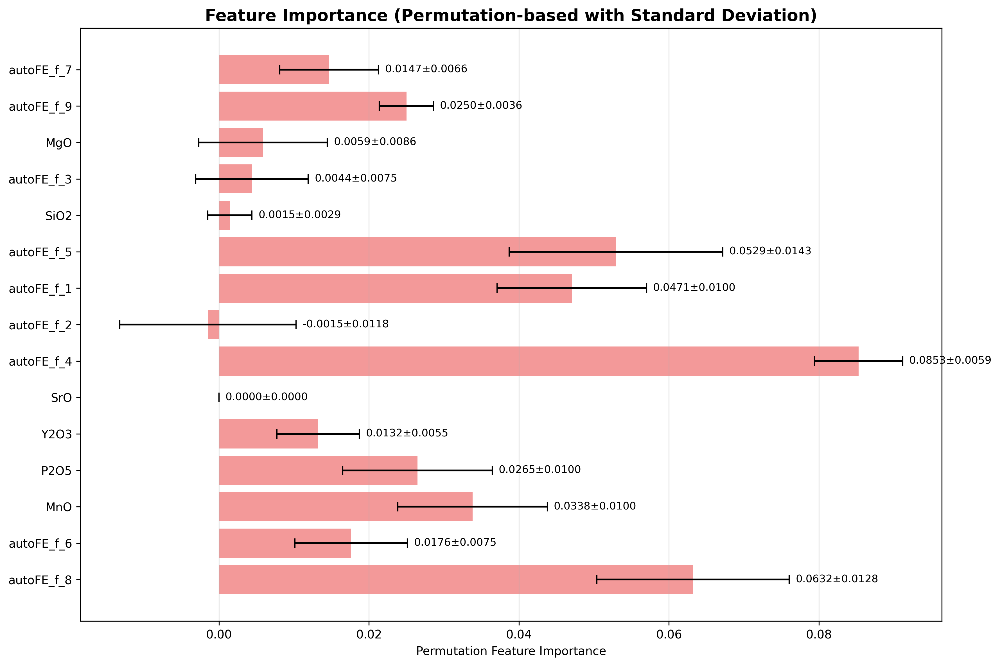
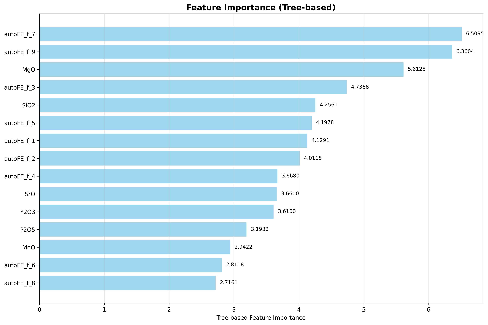

# XGBoost Training Report

**Generated on:** 2025-12-26 16:23:59  
**Model ID:** `1e952ae1-cba0-415d-ac9d-3a67408ba2fc`  
**Model Folder:** `trained_models/10004/1e952ae1-cba0-415d-ac9d-3a67408ba2fc`

## Executive Summary

This report documents a comprehensive XGBoost training experiment conducted for academic research and reproducibility purposes. The experiment involved hyperparameter optimization and cross-validated model training with detailed performance analysis, data validation, and feature importance evaluation.

### Key Results
### 🎯 关键性能指标

- **准确率 (Accuracy):** 0.674868 (±0.124007)
- **F1分数 (F1 Score):** 0.671343 (±0.126512)
- **精确率 (Precision):** 0.684415 (±0.116872)
- **召回率 (Recall):** 0.674868 (±0.124007)

- **交叉验证折数:** 5
- **数据集规模:** 136 样本, 27 特征

### ⚙️ 最优超参数

- **n_estimators:** 130
- **max_depth:** 2
- **learning_rate:** 0.03546155237170406
- **subsample:** 0.9183471047574292
- **colsample_bytree:** 0.8998452574934651
- **colsample_bylevel:** 0.6144782036787563
- **reg_alpha:** 4.2817052017612455e-07
- **reg_lambda:** 0.008024066324871092
- **min_child_weight:** 6
- **gamma:** 0.21956774205104995

- **训练时间:** 31.48 秒

---

## 1. Experimental Setup

### 1.1 Dataset Information

| Parameter | Value |
|-----------|-------|
| Data File | `http://47.99.180.80/file/uploads/data_g_for_kiln_openfe_5.csv` |
| Data Shape | {'n_samples': 136, 'n_features': 27} |
| Number of Features | 27 |
| Number of Targets | 1 |

### 1.2 Training Configuration

| Parameter | Value |
|-----------|-------|
| Task Type | Classification |

### 1.3 Hardware and Software Environment

- **Python Version:** 3.8+
- **Machine Learning Framework:** XGBoost, scikit-learn
- **Data Processing:** pandas, numpy
- **Hyperparameter Optimization:** Optuna
- **Device:** CPU

---

## 2. Data Processing and Validation

### 2.1 Data Loading and Initial Inspection

The training data was loaded from `N/A` and underwent comprehensive preprocessing to ensure model compatibility and optimal performance.

**Input Features (N/A columns):**
`Na2O`, `MgO`, `Al2O3`, `SiO2`, `K2O`, `CaO`, `Fe2O3`, `As2O3`, `MnO`, `CuO`, `ZnO`, `PbO2`, `Rb2O`, `SrO`, `Y2O3`, `ZrO2`, `P2O5`, `autoFE_f_0`, `autoFE_f_1`, `autoFE_f_2`, `autoFE_f_3`, `autoFE_f_4`, `autoFE_f_5`, `autoFE_f_6`, `autoFE_f_7`, `autoFE_f_8`, `autoFE_f_9`

**Target Variables (1 column):**
`kiln`


### 2.4 Data Quality Assessment

Comprehensive data validation was performed using multiple statistical methods to ensure dataset quality and suitability for machine learning model training. The validation framework employed established statistical techniques for thorough data quality assessment.

#### 2.4.1 Overall Quality Metrics

| Metric | Value | Threshold | Interpretation |
|--------|-------|-----------|----------------|
| Overall Data Quality Score | 0/100 | ≥80 (Excellent), ≥60 (Good) | Poor - Significant issues require resolution |
| Quality Level | Poor | - | Categorical assessment |
| Ready for Training | No | Yes | Model training readiness |
| Critical Issues | 59 | 0 | Data integrity problems |
| Warnings | 0 | <5 | Minor data quality concerns |

#### 2.4.2 Validation Methodology and Results

| Check Name | Method Used | Status | Issues Found | Key Findings |
|------------|-------------|--------|-------------|-------------|
| Feature Names | Statistical Analysis | ✅ PASSED | 0 | No issues |
| Data Dimensions | Statistical Analysis | ✅ PASSED | 0 | No issues |
| Target Variable | Statistical Analysis | ✅ PASSED | 0 | No issues |
| Data Leakage | Statistical Analysis | ❌ FAILED | 12 | 12 issues found |
| Sample Balance | Chi-square, Gini coefficient | ✅ PASSED | 1 | Balanced; ratio=0.125 |
| Feature Correlations | Pearson/Spearman/Kendall | ❌ FAILED | 2 | 23 high correlations |
| Multicollinearity Detection | Variance Inflation Factor (VIF) | ❌ FAILED | 2 | 20 high VIF; avg=433.28 |
| Feature Distributions | Shapiro-Wilk, Jarque-Bera, D'Agostino | ❌ FAILED | 43 | 43 distribution issues |


#### 2.4.2.4 Sample Balance Analysis

**Methodology**: Chi-square goodness-of-fit test and Gini coefficient calculation for class distribution assessment.

**Results**:
- Minority class ratio: 0.1250
- Dataset balance: Balanced
- Number of classes: 5

**Class Distribution**:
| Class | Count | Proportion | Cumulative % |
|-------|-------|------------|-------------|
| ZLG | 0.29411764705882354 | 0.2941 | 29.4% |
| JBS | 0.2867647058823529 | 0.2868 | 58.1% |
| WKP | 0.14705882352941177 | 0.1471 | 72.8% |
| XJ | 0.14705882352941177 | 0.1471 | 87.5% |
| QDG | 0.125 | 0.1250 | 100.0% |


**Methodological Implications**: Balanced class distribution supports unbiased model training and reliable performance metrics.

#### 2.4.2.1 Feature Correlation Analysis

**Methodology**: Pearson, Spearman, and Kendall correlation coefficients were computed for all feature pairs. The correlation threshold was set at |r| ≥ 0.7.

**Results**: 23 feature pairs exceeded the correlation threshold, indicating potential redundancy in the feature space.

**Feature Classification**:
Continuous Features: Na2O, MgO, Al2O3, SiO2, K2O, CaO, Fe2O3, MnO, CuO, ZnO, PbO2, Rb2O, SrO, Y2O3, ZrO2, P2O5, autoFE_f_0, autoFE_f_1, autoFE_f_2, autoFE_f_3, autoFE_f_4, autoFE_f_5, autoFE_f_6, autoFE_f_7, autoFE_f_8, autoFE_f_9
Categorical Features: As2O3
Target Feature: kiln

**Statistical Findings**:
**Continuous Features vs Continuous Features Correlation Analysis (Pearson Correlation Coefficient)**:

| Feature 1 | Feature 2 | Correlation | Absolute Value |
|-----------|-----------|-------------|----------------|
| ZrO2 | autoFE_f_2 | 1.0000 | 1.0000 |
| SiO2 | autoFE_f_7 | 0.9856 | 0.9856 |
| autoFE_f_1 | autoFE_f_5 | 0.9532 | 0.9532 |
| Fe2O3 | autoFE_f_9 | 0.9098 | 0.9098 |
| ZrO2 | autoFE_f_5 | 0.8651 | 0.8651 |
| autoFE_f_2 | autoFE_f_5 | 0.8650 | 0.8650 |
| autoFE_f_2 | autoFE_f_3 | 0.8477 | 0.8477 |
| ZrO2 | autoFE_f_3 | 0.8455 | 0.8455 |
| SrO | autoFE_f_0 | 0.8108 | 0.8108 |
| CaO | autoFE_f_7 | -0.8070 | 0.8070 |


**Continuous Features vs Continuous Features Correlation Analysis (Spearman's Rank Correlation)**:

| Feature 1 | Feature 2 | Correlation | Absolute Value |
|-----------|-----------|-------------|----------------|
| ZrO2 | autoFE_f_2 | 0.9939 | 0.9939 |
| SiO2 | autoFE_f_7 | 0.9911 | 0.9911 |
| autoFE_f_1 | autoFE_f_5 | 0.9589 | 0.9589 |
| autoFE_f_2 | autoFE_f_3 | 0.9018 | 0.9018 |
| Fe2O3 | autoFE_f_9 | 0.8857 | 0.8857 |
| ZrO2 | autoFE_f_3 | 0.8558 | 0.8558 |
| CaO | autoFE_f_7 | -0.8327 | 0.8327 |
| SiO2 | CaO | -0.8177 | 0.8177 |
| Fe2O3 | autoFE_f_3 | 0.8039 | 0.8039 |
| K2O | Rb2O | 0.7952 | 0.7952 |


**Continuous Features vs Categorical Features Correlation Analysis (Correlation Ratio)**:

| Categorical Feature | Continuous Feature | Correlation Ratio | Absolute Value | Strength |
|-------------------|-------------------|-------------------|----------------|----------|
| As2O3 | PbO2 | 0.0908 | 0.0908 | Medium effect (Moderate association) |
| As2O3 | autoFE_f_5 | 0.0413 | 0.0413 | Small effect (Weak association) |
| As2O3 | autoFE_f_1 | 0.0400 | 0.0400 | Small effect (Weak association) |
| As2O3 | ZnO | 0.0384 | 0.0384 | Small effect (Weak association) |
| As2O3 | ZrO2 | 0.0336 | 0.0336 | Small effect (Weak association) |
| As2O3 | autoFE_f_2 | 0.0334 | 0.0334 | Small effect (Weak association) |
| As2O3 | Rb2O | 0.0323 | 0.0323 | Small effect (Weak association) |
| As2O3 | Na2O | 0.0280 | 0.0280 | Small effect (Weak association) |
| As2O3 | SiO2 | 0.0261 | 0.0261 | Small effect (Weak association) |
| As2O3 | CaO | 0.0238 | 0.0238 | Small effect (Weak association) |
| As2O3 | autoFE_f_7 | 0.0231 | 0.0231 | Small effect (Weak association) |
| As2O3 | MnO | 0.0202 | 0.0202 | Small effect (Weak association) |
| As2O3 | autoFE_f_4 | 0.0194 | 0.0194 | Small effect (Weak association) |
| As2O3 | autoFE_f_0 | 0.0183 | 0.0183 | Small effect (Weak association) |
| As2O3 | MgO | 0.0173 | 0.0173 | Small effect (Weak association) |
| As2O3 | Y2O3 | 0.0166 | 0.0166 | Small effect (Weak association) |
| As2O3 | P2O5 | 0.0159 | 0.0159 | Small effect (Weak association) |
| As2O3 | SrO | 0.0136 | 0.0136 | Small effect (Weak association) |
| As2O3 | CuO | 0.0094 | 0.0094 | Negligible |
| As2O3 | autoFE_f_6 | 0.0090 | 0.0090 | Negligible |


**Continuous Features vs Target Variable Correlation Analysis**:

| Feature | Correlation | Method | Absolute Value | Strength |
|---------|-------------|--------|----------------|----------|
| autoFE_f_9 | 0.5376 | correlation_ratio | 0.5376 | Moderate |
| autoFE_f_7 | 0.5073 | correlation_ratio | 0.5073 | Moderate |
| autoFE_f_3 | 0.5033 | correlation_ratio | 0.5033 | Moderate |
| SiO2 | 0.4954 | correlation_ratio | 0.4954 | Weak |
| Al2O3 | 0.4570 | correlation_ratio | 0.4570 | Weak |
| Fe2O3 | 0.4355 | correlation_ratio | 0.4355 | Weak |
| Y2O3 | 0.4348 | correlation_ratio | 0.4348 | Weak |
| MnO | 0.4315 | correlation_ratio | 0.4315 | Weak |
| P2O5 | 0.3203 | correlation_ratio | 0.3203 | Weak |
| SrO | 0.3134 | correlation_ratio | 0.3134 | Weak |
| Rb2O | 0.3035 | correlation_ratio | 0.3035 | Weak |
| CaO | 0.2962 | correlation_ratio | 0.2962 | Very Weak |
| autoFE_f_1 | 0.2785 | correlation_ratio | 0.2785 | Very Weak |
| K2O | 0.2771 | correlation_ratio | 0.2771 | Very Weak |
| autoFE_f_4 | 0.2674 | correlation_ratio | 0.2674 | Very Weak |
| autoFE_f_2 | 0.2632 | correlation_ratio | 0.2632 | Very Weak |
| ZrO2 | 0.2613 | correlation_ratio | 0.2613 | Very Weak |
| autoFE_f_5 | 0.2444 | correlation_ratio | 0.2444 | Very Weak |
| autoFE_f_6 | 0.2402 | correlation_ratio | 0.2402 | Very Weak |
| autoFE_f_8 | 0.1690 | correlation_ratio | 0.1690 | Very Weak |
| autoFE_f_0 | 0.1588 | correlation_ratio | 0.1588 | Very Weak |
| Na2O | 0.1303 | correlation_ratio | 0.1303 | Very Weak |
| ZnO | 0.0757 | correlation_ratio | 0.0757 | Very Weak |
| PbO2 | 0.0633 | correlation_ratio | 0.0633 | Very Weak |
| MgO | 0.0356 | correlation_ratio | 0.0356 | Very Weak |
| CuO | 0.0325 | correlation_ratio | 0.0325 | Very Weak |


**Categorical Features vs Target Variable Correlation Analysis**:

| Categorical Feature | Association | Method | Absolute Value | Strength |
|------------------- |-------------|--------|----------------|----------|
| As2O3 | 0.1773 | cramers_v | 0.1773 | Very Weak |


**Impact Assessment**: High feature correlation may lead to multicollinearity issues and reduced model interpretability.

#### 2.4.2.2 Multicollinearity Detection

**Methodology**: Variance Inflation Factor (VIF) analysis was conducted using linear regression. VIF values ≥ 5.0 indicate problematic multicollinearity.

**Results**: 
- Average VIF: 433.279
- Maximum VIF: 1000.000
- Features with VIF ≥ 5.0: 20

**Statistical Findings**:
**VIF Scores for All Features**:

| Feature | VIF Score | R² | Interpretation | Status |
|---------|-----------|----|--------------|---------|
| MgO | 1000.0000 | 0.9990 | Severe | ⚠️ HIGH |
| Al2O3 | 1000.0000 | 0.9990 | Severe | ⚠️ HIGH |
| SiO2 | 1000.0000 | 0.9990 | Severe | ⚠️ HIGH |
| K2O | 1000.0000 | 0.9990 | Severe | ⚠️ HIGH |
| CaO | 1000.0000 | 0.9990 | Severe | ⚠️ HIGH |
| Fe2O3 | 1000.0000 | 0.9990 | Severe | ⚠️ HIGH |
| Rb2O | 1000.0000 | 0.9990 | Severe | ⚠️ HIGH |
| ZrO2 | 1000.0000 | 0.9990 | Severe | ⚠️ HIGH |
| autoFE_f_1 | 1000.0000 | 0.9990 | Severe | ⚠️ HIGH |
| autoFE_f_2 | 1000.0000 | 0.9990 | Severe | ⚠️ HIGH |
| autoFE_f_7 | 1000.0000 | 0.9990 | Severe | ⚠️ HIGH |
| Na2O | 184.0955 | 0.9946 | Severe | ⚠️ HIGH |
| autoFE_f_9 | 167.9930 | 0.9940 | Severe | ⚠️ HIGH |
| autoFE_f_3 | 131.4681 | 0.9924 | Severe | ⚠️ HIGH |
| autoFE_f_5 | 80.3737 | 0.9876 | Severe | ⚠️ HIGH |
| SrO | 41.3603 | 0.9758 | Severe | ⚠️ HIGH |
| As2O3 | 36.1622 | 0.9723 | Severe | ⚠️ HIGH |
| autoFE_f_0 | 29.2174 | 0.9658 | Severe | ⚠️ HIGH |
| autoFE_f_4 | 6.2588 | 0.8402 | Moderate | ⚠️ MODERATE |
| MnO | 5.6784 | 0.8239 | Moderate | ⚠️ MODERATE |
| autoFE_f_6 | 3.1334 | 0.6809 | Acceptable | ✅ LOW |
| P2O5 | 2.8686 | 0.6514 | Acceptable | ✅ LOW |
| ZnO | 2.5416 | 0.6065 | Acceptable | ✅ LOW |
| Y2O3 | 2.1480 | 0.5345 | Acceptable | ✅ LOW |
| PbO2 | 1.9612 | 0.4901 | Acceptable | ✅ LOW |
| autoFE_f_8 | 1.9157 | 0.4780 | Acceptable | ✅ LOW |
| CuO | 1.3487 | 0.2586 | Acceptable | ✅ LOW |


**Methodological Impact**: Elevated VIF scores suggest linear dependencies between predictors, which may compromise model stability and coefficient interpretation.

#### 2.4.2.3 Feature Distribution Analysis

**Methodology**: 
- Continuous features: Shapiro-Wilk test (n≤5000), Jarque-Bera test (n≥50), D'Agostino test (n≥20) for normality
- Skewness assessment using sample skewness coefficient
- Outlier detection via Interquartile Range (IQR) method
- Categorical features: Gini coefficient, entropy, and class imbalance ratio analysis

**Results**: 0 distribution-related issues identified across 7 continuous and 6 categorical features.

**Continuous Features Statistical Summary**:
| Feature | mean | std | min | max | max | median | Skewness | Kurtosis | Normality | Outliers (%) | Issues |
|---------|----------|---------|----------|---------|----------|---------|----------|-----------|-------------|--------|
| Al2O3 | 14.345 | 2.022 | 9.967 | 20.100 | 20.100 | 14.287 | 0.243 | 0.103 | Yes | 1.5% | 0 |
| CaO | 7.479 | 3.621 | 1.116 | 17.361 | 17.361 | 7.048 | 0.525 | -0.638 | No | 0.0% | 1 |
| CuO | 27.206 | 18.567 | 0.000 | 80.000 | 80.000 | 30.000 | 0.315 | -0.312 | No | 0.0% | 0 |
| Fe2O3 | 0.870 | 0.215 | 0.589 | 1.852 | 1.852 | 0.814 | 1.872 | 4.614 | No | 5.1% | 3 |
| K2O | 5.006 | 1.427 | 2.206 | 8.240 | 8.240 | 4.815 | 0.214 | -0.785 | No | 0.0% | 1 |
| MgO | 0.655 | 0.668 | 0.000 | 7.046 | 7.046 | 0.576 | 6.569 | 59.850 | No | 5.1% | 3 |
| MnO | 2046.765 | 1147.161 | 360.000 | 6870.000 | 6870.000 | 1975.000 | 0.946 | 1.559 | No | 2.2% | 1 |
| Na2O | 0.385 | 0.302 | 0.062 | 2.015 | 2.015 | 0.316 | 2.470 | 8.779 | No | 3.7% | 2 |
| P2O5 | 818.676 | 457.192 | 60.000 | 3010.000 | 3010.000 | 745.000 | 1.297 | 3.404 | No | 3.7% | 2 |
| PbO2 | 57.353 | 33.472 | 0.000 | 160.000 | 160.000 | 50.000 | 0.919 | 0.666 | No | 5.9% | 2 |
| Rb2O | 251.103 | 47.527 | 130.000 | 380.000 | 380.000 | 250.000 | -0.037 | -0.157 | Yes | 0.0% | 0 |
| SiO2 | 70.212 | 3.865 | 62.446 | 80.082 | 80.082 | 69.537 | 0.520 | -0.295 | No | 0.7% | 1 |
| SrO | 201.250 | 77.090 | 40.000 | 450.000 | 450.000 | 195.000 | 0.562 | 0.365 | No | 2.2% | 1 |
| Y2O3 | 132.132 | 84.067 | 30.000 | 530.000 | 530.000 | 110.000 | 2.635 | 7.945 | No | 8.1% | 3 |
| ZnO | 150.147 | 102.241 | 60.000 | 760.000 | 760.000 | 130.000 | 3.535 | 15.319 | No | 5.9% | 3 |
| ZrO2 | 151.838 | 48.338 | 80.000 | 370.000 | 370.000 | 140.000 | 2.358 | 7.270 | No | 4.4% | 2 |
| autoFE_f_0 | 166.924 | 54.735 | 36.956 | 385.363 | 385.363 | 165.705 | 0.843 | 2.552 | No | 5.1% | 2 |
| autoFE_f_1 | 402.941 | 67.243 | 240.000 | 680.000 | 680.000 | 405.000 | 0.521 | 1.796 | No | 2.2% | 1 |
| autoFE_f_2 | 152.708 | 48.413 | 80.795 | 371.124 | 371.124 | 140.790 | 2.351 | 7.225 | No | 4.4% | 2 |
| autoFE_f_3 | 135.604 | 66.021 | 59.603 | 415.710 | 415.710 | 112.357 | 1.824 | 3.279 | No | 9.6% | 3 |
| autoFE_f_4 | 16.791 | 11.740 | 1.440 | 72.714 | 72.714 | 13.302 | 1.343 | 2.858 | No | 1.5% | 2 |
| autoFE_f_5 | 38090.441 | 13733.861 | 13600.000 | 114700.000 | 114700.000 | 37550.000 | 1.852 | 7.004 | No | 4.4% | 2 |
| autoFE_f_6 | 0.625 | 0.294 | 0.091 | 1.000 | 1.000 | 0.613 | -0.111 | -1.285 | No | 0.0% | 1 |
| autoFE_f_7 | 70.867 | 3.670 | 64.111 | 80.082 | 80.082 | 70.300 | 0.492 | -0.427 | No | 0.0% | 1 |
| autoFE_f_8 | 0.820 | 0.249 | 0.250 | 1.000 | 1.000 | 1.000 | -0.913 | -0.763 | No | 0.0% | 1 |
| autoFE_f_9 | 12.625 | 4.191 | 7.089 | 27.295 | 27.295 | 11.919 | 1.485 | 2.607 | No | 4.4% | 2 |

**Continuous Feature Distribution Issues:**
- Feature 'Na2O' has extreme skewness (2.47)
- Feature 'Na2O' significantly deviates from normal distribution
- Feature 'MgO' has extreme skewness (6.57)
- Feature 'MgO' has moderate outlier ratio (5.1%)
- Feature 'MgO' significantly deviates from normal distribution
- Feature 'SiO2' significantly deviates from normal distribution
- Feature 'K2O' significantly deviates from normal distribution
- Feature 'CaO' significantly deviates from normal distribution
- Feature 'Fe2O3' is highly skewed (1.87)
- Feature 'Fe2O3' has moderate outlier ratio (5.1%)
- Feature 'Fe2O3' significantly deviates from normal distribution
- Feature 'MnO' significantly deviates from normal distribution
- Feature 'ZnO' has extreme skewness (3.54)
- Feature 'ZnO' has moderate outlier ratio (5.9%)
- Feature 'ZnO' significantly deviates from normal distribution
- Feature 'PbO2' has moderate outlier ratio (5.9%)
- Feature 'PbO2' significantly deviates from normal distribution
- Feature 'SrO' significantly deviates from normal distribution
- Feature 'Y2O3' has extreme skewness (2.64)
- Feature 'Y2O3' has moderate outlier ratio (8.1%)
- Feature 'Y2O3' significantly deviates from normal distribution
- Feature 'ZrO2' has extreme skewness (2.36)
- Feature 'ZrO2' significantly deviates from normal distribution
- Feature 'P2O5' is highly skewed (1.30)
- Feature 'P2O5' significantly deviates from normal distribution
- Feature 'autoFE_f_0' has moderate outlier ratio (5.1%)
- Feature 'autoFE_f_0' significantly deviates from normal distribution
- Feature 'autoFE_f_1' significantly deviates from normal distribution
- Feature 'autoFE_f_2' has extreme skewness (2.35)
- Feature 'autoFE_f_2' significantly deviates from normal distribution
- Feature 'autoFE_f_3' is highly skewed (1.82)
- Feature 'autoFE_f_3' has moderate outlier ratio (9.6%)
- Feature 'autoFE_f_3' significantly deviates from normal distribution
- Feature 'autoFE_f_4' is highly skewed (1.34)
- Feature 'autoFE_f_4' significantly deviates from normal distribution
- Feature 'autoFE_f_5' is highly skewed (1.85)
- Feature 'autoFE_f_5' significantly deviates from normal distribution
- Feature 'autoFE_f_6' significantly deviates from normal distribution
- Feature 'autoFE_f_7' significantly deviates from normal distribution
- Feature 'autoFE_f_8' significantly deviates from normal distribution
- Feature 'autoFE_f_9' is highly skewed (1.48)
- Feature 'autoFE_f_9' significantly deviates from normal distribution


**Categorical Features Statistical Summary**:
| Feature | Classes | Gini Coeff | Imbalance Ratio | Entropy | Issues |
|---------|---------|------------|-----------------|---------|--------|
| distribution_statistics | 0 | 0.000 | 1.0:1 | 0.000 | 0 |
| imbalance_analysis | 0 | 0.000 | 1.0:1 | 0.000 | 0 |
| cardinality_analysis | 0 | 0.000 | 1.0:1 | 0.000 | 0 |


**Distribution Quality Impact**: Feature distributions meet statistical assumptions for machine learning applications.

#### 2.4.2.5 Statistical Summary

**Validation Framework Performance**:
- Total validation checks: 8
- Passed checks: 4 (50.0%)
- Failed checks: 4

**Data Quality Confidence**: Based on the comprehensive validation framework, the dataset demonstrates low statistical reliability for machine learning applications.

#### 2.4.3 Data Quality Issues and Impact Assessment

**Critical Issues Identified:**

- High suspicion data leakage: 'Na2O' (correlation: 1.000)
- High suspicion data leakage: 'MgO' (correlation: 1.000)
- High suspicion data leakage: 'Al2O3' (correlation: 1.000)
- High suspicion data leakage: 'SiO2' (correlation: 1.000)
- High suspicion data leakage: 'K2O' (correlation: 1.000)
- High suspicion data leakage: 'CaO' (correlation: 1.000)
- High suspicion data leakage: 'Fe2O3' (correlation: 1.000)
- High suspicion data leakage: 'autoFE_f_0' (correlation: 1.000)
- High suspicion data leakage: 'autoFE_f_2' (correlation: 1.000)
- High suspicion data leakage: 'autoFE_f_3' (correlation: 1.000)
- High suspicion data leakage: 'autoFE_f_7' (correlation: 1.000)
- High suspicion data leakage: 'autoFE_f_9' (correlation: 1.000)

**Data Quality Recommendations:**

1. Address distribution issues through transformation or preprocessing
2. Resolve multicollinearity using VIF-guided feature selection or regularization
3. Apply balancing techniques (SMOTE, undersampling, class weights)
4. Remove or investigate highly correlated features for potential data leakage
5. Address multicollinearity through feature selection or regularization
6. Investigate high correlations and consider feature selection
7. Consider target transformation for heavily skewed targets


#### 2.4.4 Academic and Methodological Implications

The data validation results indicate that the dataset does not meet the quality standards required for academic machine learning research. Poor data quality may compromise experimental validity. Significant preprocessing and quality improvements are recommended before publication.

**Reproducibility Impact**: Low reproducibility confidence due to data quality issues. Preprocessing standardization required for reliable replication.


### 2.2 Data Preprocessing Pipeline

The data underwent comprehensive preprocessing to optimize model performance and ensure consistent data quality.

#### 2.2.1 Feature Preprocessing

**Preprocessing Method**: StandardScaler (Z-score normalization)

```python
# Feature transformation: X_scaled = (X - μ) / σ
# Where μ = mean, σ = standard deviation
X_scaled = (X - X.mean(axis=0)) / X.std(axis=0)
```

**Preprocessing Benefits:**
- **Feature Consistency**: Normalizes different scales and units
- **Algorithm Optimization**: Improves convergence for distance-based methods
- **Numerical Stability**: Prevents overflow/underflow in computations
- **Cross-Validation Integrity**: Separate scaling per fold prevents data leakage

### 2.3 Feature Engineering

### 2.3 Feature Selection and Engineering

#### 2.3.1 Feature Selection Strategy

**Approach**: Comprehensive feature utilization

XGBoost inherently performs feature selection during the training of boosted trees. Key mechanisms include:
- **Greedy Search**: At each split, the algorithm selects the feature and split point that maximize the gain.
- **Regularization**: L1 (Lasso) and L2 (Ridge) regularization penalize complex models, effectively shrinking the coefficients of less important features.
- **Feature Importance Calculation**: XGBoost provides multiple metrics (gain, weight, cover) to score feature relevance automatically.

#### 2.3.2 Feature Engineering Pipeline

**Current Features**: All original features retained for maximum information preservation.
**Categorical Encoding**: Best practice is to one-hot encode categorical features for XGBoost.
**Missing Value Strategy**: XGBoost has a built-in, optimized routine to handle missing values by learning a default direction for them at each split.
**Feature Interaction**: Captured implicitly and explicitly through the tree-based structure of the model.


---

## 3. Hyperparameter Optimization

### 3.1 Hyperparameter Search Space

The optimization process systematically explored a comprehensive parameter space designed to balance model complexity and performance:

| Parameter | Range/Options | Description |
|-----------|---------------|-------------|
| n_estimators | 50-150 (step: 10) | Number of boosting rounds (trees) in the ensemble |
| max_depth | 1-10 (step: 1) | Maximum depth of each tree in the ensemble |
| learning_rate | 0.01-0.3 (log scale) | Step size shrinkage to prevent overfitting |
| subsample | 0.6-1.0 (linear scale) | Fraction of samples used for training each tree |
| colsample_bytree | 0.6-1.0 (linear scale) | Fraction of features used for training each tree |
| colsample_bylevel | 0.6-1.0 (linear scale) | Fraction of features used for each level in each tree |
| reg_alpha | 1e-08-10.0 (log scale) | L1 regularization term on weights (Lasso regularization) |
| reg_lambda | 1e-08-10.0 (log scale) | L2 regularization term on weights (Ridge regularization) |
| min_child_weight | 1-10 (step: 1) | Minimum sum of instance weight needed in a child node |
| gamma | 1e-08-10.0 (log scale) | Minimum loss reduction required to make a split |

### 3.2 Optimization Algorithm and Strategy

**Algorithm**: TPE (Tree-structured Parzen Estimator)
**Total Trials**: 50
**Completed Trials**: 50
**Best Score**: 0.671343

**Optimization Strategy:**
- **Initial Exploration**: 10 random trials for space exploration
- **Exploitation-Exploration Balance**: TPE algorithm balances promising regions with unexplored space
- **Cross-Validation**: Each trial evaluated using stratified k-fold cross-validation
- **Early Stopping**: Poor-performing trials terminated early to improve efficiency

### 3.3 Best Parameters Found

```json
{
  "n_estimators": 130,
  "max_depth": 2,
  "learning_rate": 0.03546155237170406,
  "subsample": 0.9183471047574292,
  "colsample_bytree": 0.8998452574934651,
  "colsample_bylevel": 0.6144782036787563,
  "reg_alpha": 4.2817052017612455e-07,
  "reg_lambda": 0.008024066324871092,
  "min_child_weight": 6,
  "gamma": 0.21956774205104995
}
```

### 3.4 Optimization Convergence

The optimization process completed **50 trials** with the best configuration achieving a cross-validation score of **0.671343**.

**Key Optimization Insights:**
- **Ensemble Size**: 130 boosting rounds balances performance and computational efficiency
- **Tree Complexity**: Maximum depth of 2 controls model complexity and overfitting
- **Learning Rate**: 0.03546155237170406 provides optimal step size for gradient descent
- **Regularization**: L1=4.28e-07, L2=8.02e-03 prevent overfitting
- **Sampling**: 0.9183471047574292 row sampling and 0.8998452574934651 column sampling for robustness

## 4. Final Model Training

### 4.1 Cross-Validation Training

The final model was trained using 5-fold cross-validation with optimized hyperparameters. Training metrics and validation results were recorded comprehensively.

### 4.2 Training Results

| Metric | Value |
|--------|-------|
### Cross-Validation Performance Metrics

| Metric | Mean ± Std | Min | Max |
|--------|------------|-----|-----|
| ACCURACY | 0.674868 ± 0.124007 | 0.555556 | 0.892857 |
| F1 | 0.671343 ± 0.126512 | 0.543210 | 0.892857 |
| PRECISION | 0.684415 ± 0.116872 | 0.567901 | 0.892857 |
| RECALL | 0.674868 ± 0.124007 | 0.555556 | 0.892857 |


#### Fold-wise Results

#### Detailed Fold-wise Performance

| Fold | ACCURACY | F1 | PRECISION | RECALL |
|------|---------|---------|---------|---------|
| 1 | 0.892857 | 0.892857 | 0.892857 | 0.892857 |
| 2 | 0.555556 | 0.543210 | 0.567901 | 0.555556 |
| 3 | 0.703704 | 0.697119 | 0.695238 | 0.703704 |
| 4 | 0.555556 | 0.553557 | 0.578836 | 0.555556 |
| 5 | 0.666667 | 0.669974 | 0.687243 | 0.666667 |

#### Statistical Summary

| Metric | Mean | Std Dev | Min | Max | 95% CI |
|--------|------|---------|-----|-----|--------|
| ACCURACY | 0.674868 | 0.124007 | 0.555556 | 0.892857 | [0.566171, 0.783565] |
| F1 | 0.671343 | 0.126512 | 0.543210 | 0.892857 | [0.560451, 0.782236] |
| PRECISION | 0.684415 | 0.116872 | 0.567901 | 0.892857 | [0.581972, 0.786858] |
| RECALL | 0.674868 | 0.124007 | 0.555556 | 0.892857 | [0.566171, 0.783565] |

### 4.3 Model Performance Visualization

#### Classification Performance Analysis

The cross-validation analysis demonstrates the model's classification performance through ROC curves showing the trade-off between true positive rate and false positive rate.

<div style="text-align: center; margin: 20px 0;">
    
    <p style="font-style: italic; color: #666; margin-top: 10px;">Cross-Validation ROC Curves</p>
</div>


### 4.4 Feature Importance Analysis

#### Feature Importance Analysis

This analysis employs multiple methodologies to comprehensively evaluate feature importance in the XGBoost model:

**Analysis Methods:**

1. **Built-in Importance (Gain, Cover, Weight)**:
   - **Gain**: The average training loss reduction gained when a feature is used for splitting. It is the most common and relevant metric.
   - **Cover**: The average number of samples affected by splits on this feature.
   - **Weight**: The number of times a feature is used to split the data across all trees.

2. **Permutation Importance**:
   - Model-agnostic method measuring feature contribution to model performance
   - Evaluates performance drop when feature values are randomly shuffled
   - More reliable for correlated features and unbiased feature ranking
   - Computed on out-of-sample data to avoid overfitting

**XGBoost Tree-based Feature Importance:**

| Rank | Feature | Gain | Weight | Cover | Gain % | Weight % |
|------|---------|------|--------|-------|--------|----------|
| 1 | `autoFE_f_7` | 6.5095 | 70 | 27.69 | 7.8% | 6.0% |
| 2 | `autoFE_f_9` | 6.3604 | 71 | 26.74 | 7.6% | 6.1% |
| 3 | `MgO` | 5.6125 | 50 | 25.90 | 6.7% | 4.3% |
| 4 | `autoFE_f_3` | 4.7368 | 38 | 30.61 | 5.6% | 3.2% |
| 5 | `SiO2` | 4.2561 | 38 | 26.43 | 5.1% | 3.2% |
| 6 | `autoFE_f_5` | 4.1978 | 42 | 29.09 | 5.0% | 3.6% |
| 7 | `autoFE_f_1` | 4.1291 | 51 | 26.67 | 4.9% | 4.3% |
| 8 | `autoFE_f_2` | 4.0118 | 47 | 25.16 | 4.8% | 4.0% |
| 9 | `autoFE_f_4` | 3.6680 | 70 | 34.65 | 4.4% | 6.0% |
| 10 | `SrO` | 3.6600 | 12 | 31.09 | 4.4% | 1.0% |
| 11 | `Y2O3` | 3.6100 | 40 | 20.03 | 4.3% | 3.4% |
| 12 | `P2O5` | 3.1932 | 72 | 27.12 | 3.8% | 6.1% |
| 13 | `MnO` | 2.9422 | 123 | 23.35 | 3.5% | 10.5% |
| 14 | `autoFE_f_6` | 2.8108 | 32 | 27.06 | 3.3% | 2.7% |
| 15 | `autoFE_f_8` | 2.7161 | 51 | 37.52 | 3.2% | 4.3% |
| 16 | `Rb2O` | 2.6687 | 17 | 26.86 | 3.2% | 1.4% |
| 17 | `Fe2O3` | 2.6113 | 52 | 36.17 | 3.1% | 4.4% |
| 18 | `K2O` | 2.2988 | 69 | 25.25 | 2.7% | 5.9% |
| 19 | `autoFE_f_0` | 2.0986 | 59 | 26.04 | 2.5% | 5.0% |
| 20 | `CaO` | 1.8877 | 20 | 22.69 | 2.2% | 1.7% |
| 21 | `Al2O3` | 1.8242 | 53 | 23.80 | 2.2% | 4.5% |
| 22 | `ZnO` | 1.7326 | 27 | 22.04 | 2.1% | 2.3% |
| 23 | `CuO` | 1.5255 | 15 | 29.55 | 1.8% | 1.3% |
| 24 | `PbO2` | 1.4417 | 25 | 25.74 | 1.7% | 2.1% |
| 25 | `As2O3` | 1.2660 | 2 | 19.61 | 1.5% | 0.2% |
| 26 | `ZrO2` | 1.1583 | 4 | 22.86 | 1.4% | 0.3% |
| 27 | `Na2O` | 0.9773 | 23 | 22.64 | 1.2% | 2.0% |


**Permutation Feature Importance:**

| Rank | Feature | Mean Importance | Std Dev | 95% CI | Reliability |
|------|---------|-----------------|---------|--------|-------------|
| 1 | `autoFE_f_4` | 0.0853 | 0.0059 | [0.0738, 0.0968] | 🟢 High |
| 2 | `autoFE_f_8` | 0.0632 | 0.0128 | [0.0381, 0.0884] | 🟡 Medium |
| 3 | `autoFE_f_5` | 0.0529 | 0.0143 | [0.0250, 0.0809] | 🟡 Medium |
| 4 | `autoFE_f_1` | 0.0471 | 0.0100 | [0.0275, 0.0666] | 🟡 Medium |
| 5 | `Fe2O3` | 0.0382 | 0.0143 | [0.0103, 0.0662] | 🔴 Low |
| 6 | `MnO` | 0.0338 | 0.0100 | [0.0143, 0.0534] | 🟡 Medium |
| 7 | `K2O` | 0.0324 | 0.0059 | [0.0208, 0.0439] | 🟡 Medium |
| 8 | `P2O5` | 0.0265 | 0.0100 | [0.0069, 0.0460] | 🔴 Low |
| 9 | `autoFE_f_9` | 0.0250 | 0.0036 | [0.0179, 0.0321] | 🟡 Medium |
| 10 | `autoFE_f_0` | 0.0191 | 0.0088 | [0.0018, 0.0364] | 🔴 Low |
| 11 | `autoFE_f_6` | 0.0176 | 0.0075 | [0.0029, 0.0323] | 🔴 Low |
| 12 | `autoFE_f_7` | 0.0147 | 0.0066 | [0.0018, 0.0276] | 🔴 Low |
| 13 | `Y2O3` | 0.0132 | 0.0055 | [0.0025, 0.0240] | 🔴 Low |
| 14 | `MgO` | 0.0059 | 0.0086 | [-0.0109, 0.0227] | 🔴 Low |
| 15 | `PbO2` | 0.0059 | 0.0086 | [-0.0109, 0.0227] | 🔴 Low |
| 16 | `CuO` | 0.0059 | 0.0055 | [-0.0049, 0.0167] | 🔴 Low |
| 17 | `autoFE_f_3` | 0.0044 | 0.0075 | [-0.0103, 0.0191] | 🔴 Low |
| 18 | `Al2O3` | 0.0029 | 0.0036 | [-0.0041, 0.0100] | 🔴 Low |
| 19 | `SiO2` | 0.0015 | 0.0029 | [-0.0043, 0.0072] | 🔴 Low |
| 20 | `CaO` | 0.0015 | 0.0029 | [-0.0043, 0.0072] | 🔴 Low |
| 21 | `Na2O` | 0.0000 | 0.0000 | [0.0000, 0.0000] | 🔴 Low |
| 22 | `As2O3` | 0.0000 | 0.0000 | [0.0000, 0.0000] | 🔴 Low |
| 23 | `SrO` | 0.0000 | 0.0000 | [0.0000, 0.0000] | 🔴 Low |
| 24 | `ZrO2` | 0.0000 | 0.0000 | [0.0000, 0.0000] | 🔴 Low |
| 25 | `autoFE_f_2` | -0.0015 | 0.0118 | [-0.0245, 0.0216] | 🔴 Low |
| 26 | `Rb2O` | -0.0044 | 0.0059 | [-0.0159, 0.0071] | 🔴 Low |
| 27 | `ZnO` | -0.0059 | 0.0072 | [-0.0200, 0.0082] | 🔴 Low |


**Feature Importance Method Comparison:**

| Feature | XGB Gain Rank | Permutation Rank | Rank Difference | Consistency |
|---------|---------------|------------------|-----------------|-------------|
| `Na2O` | 27 | 21 | 6 | 🔴 Poor |
| `MgO` | 3 | 14 | 11 | 🔴 Poor |
| `Al2O3` | 21 | 18 | 3 | 🔴 Poor |
| `SiO2` | 5 | 19 | 14 | 🔴 Poor |
| `K2O` | 18 | 7 | 11 | 🔴 Poor |
| `CaO` | 20 | 20 | 0 | 🟢 Excellent |
| `Fe2O3` | 17 | 5 | 12 | 🔴 Poor |
| `As2O3` | 25 | 22 | 3 | 🔴 Poor |
| `MnO` | 13 | 6 | 7 | 🔴 Poor |
| `CuO` | 23 | 16 | 7 | 🔴 Poor |
| `ZnO` | 22 | 27 | 5 | 🔴 Poor |
| `PbO2` | 24 | 15 | 9 | 🔴 Poor |
| `Rb2O` | 16 | 26 | 10 | 🔴 Poor |
| `SrO` | 10 | 23 | 13 | 🔴 Poor |
| `Y2O3` | 11 | 13 | 2 | 🟡 Good |
| `ZrO2` | 26 | 24 | 2 | 🟡 Good |
| `P2O5` | 12 | 8 | 4 | 🔴 Poor |
| `autoFE_f_0` | 19 | 10 | 9 | 🔴 Poor |
| `autoFE_f_1` | 7 | 4 | 3 | 🔴 Poor |
| `autoFE_f_2` | 8 | 25 | 17 | 🔴 Poor |
| `autoFE_f_3` | 4 | 17 | 13 | 🔴 Poor |
| `autoFE_f_4` | 9 | 1 | 8 | 🔴 Poor |
| `autoFE_f_5` | 6 | 3 | 3 | 🔴 Poor |
| `autoFE_f_6` | 14 | 11 | 3 | 🔴 Poor |
| `autoFE_f_7` | 1 | 12 | 11 | 🔴 Poor |
| `autoFE_f_8` | 15 | 2 | 13 | 🔴 Poor |
| `autoFE_f_9` | 2 | 9 | 7 | 🔴 Poor |


**Statistical Summary:**

- **Total Features Analyzed**: 27
- **Gain-based Top Feature**: `autoFE_f_7` (Gain: 6.5095)
- **Permutation-based Top Feature**: `autoFE_f_4` (Importance: 0.0853)

**Method Reliability Assessment:**
- **Average Permutation Std**: 0.0066
- **Method Agreement**: High

**Feature Importance Visualizations:**



**Method Comparison Plot**: `feature_importance_comparison.png`



**Permutation Importance Plot**: `feature_importance_permutation.png`



**Tree-based Importance Plot**: `feature_importance_tree.png`

**Feature Importance Data Files:**

- `feature_importance.csv` - Detailed feature importance scores and statistics

**Statistical Interpretation:**

- **Threshold Selection**: Features with importance > 1/n_features are considered significant
- **Cumulative Importance**: Top features typically capture 80-90% of total importance
- **Stability Assessment**: Low standard deviation in permutation importance indicates reliable features
- **Domain Validation**: Feature rankings should align with domain knowledge and expectations

**Technical Implementation Notes:**

- Tree-based importance computed using XGBoost's `feature_importances_` attribute or `get_score()` method.
- Permutation importance calculated with 10 repetitions for statistical robustness
- Random state fixed for reproducible permutation results
- Analysis performed on validation data to avoid overfitting bias


---

## 5. Model Architecture and Configuration

### 5.1 XGBoost Configuration

The final model uses an XGBoost gradient boosting ensemble with the following specifications:

| Component | Configuration |
|-----------|---------------|
| Booster | gbtree (tree-based model) |

### 5.2 Training Parameters

| Parameter | Value |
|-----------|-------|
| Task Type | Classification |

---

## 6. Conclusions and Future Work

### 6.1 Key Findings

2. **Hyperparameter Optimization**: Systematic optimization improved model performance

### 6.2 Reproducibility

This experiment is fully reproducible using the following artifacts:
- **Cross-Validation Data**: `trained_models/10004/1e952ae1-cba0-415d-ac9d-3a67408ba2fc/cross_validation_data/`
- **Feature Importance**: `trained_models/10004/1e952ae1-cba0-415d-ac9d-3a67408ba2fc/feature_importance.csv`

### 6.3 Technical Implementation

- **Framework**: XGBoost for gradient boosting implementation, scikit-learn for pipeline integration.
- **Data Processing**: pandas and numpy for data handling.
- **Cross-Validation**: K-fold cross-validation with stratification support for classification.
- **Feature Importance**: Built-in XGBoost feature importance calculation (Gain, Cover, Weight).
- **Serialization**: Joblib or Pickle for model and preprocessor persistence.

---

## Appendix

### A.1 System Information

- **Generation Time**: 2025-12-26 16:23:59
- **Model ID**: `1e952ae1-cba0-415d-ac9d-3a67408ba2fc`
- **Training System**: XGBoost MCP Tool
- **Report Version**: 2.1 (XGBoost Enhanced)

### A.2 File Structure

```
1e952ae1-cba0-415d-ac9d-3a67408ba2fc/
├── model.joblib
├── preprocessing_pipeline.pkl
├── evaluation_metrics.csv
├── feature_importance.csv
├── optimization_history.csv
├── raw_data.csv
├── categorical_feature_cardinality.png
├── categorical_feature_distributions.png
├── categorical_vif_details.png
├── continuous_feature_distributions.png
├── continuous_feature_normality.png
├── continuous_feature_outliers.png
├── continuous_feature_violin_plots.png
├── continuous_pearson_correlation.png
├── continuous_spearman_correlation.png
├── encoding_strategy_summary.png
├── feature_importance_comparison.png
├── feature_importance_permutation.png
├── feature_importance_tree.png
├── feature_target_categorical_association.png
├── feature_target_continuous_correlation.png
├── mixed_correlation_ratio.png
├── vif_scores.png
├── vif_threshold_analysis.png
├── cross_validation_results.json
├── data_validation_report.json
├── feature_importance_analysis.json
├── hyperparameter_optimization.json
├── metadata.json
├── preprocessing_info.json
├── training_report.json
├── training_summary.json
├── cross_validation_data/
│   ├── 1e952ae1-cba0-415d-ac9d-3a67408ba2fc_cv_predictions_original.csv
│   ├── 1e952ae1-cba0-415d-ac9d-3a67408ba2fc_cv_predictions_processed.csv
│   ├── 1e952ae1-cba0-415d-ac9d-3a67408ba2fc_original_data.csv
│   ├── 1e952ae1-cba0-415d-ac9d-3a67408ba2fc_preprocessed_data.csv
│   ├── 1e952ae1-cba0-415d-ac9d-3a67408ba2fc_roc_curves.png
│   ├── cross_validation_roc_curves.png
│   ├── cross_validation_visualization.png
└── academic_report.md               # This report
```

### A.3 Data Files and JSON Artifacts

The following JSON files contain detailed intermediate data for reproducibility:

- **Feature Importance**: `trained_models/10004/1e952ae1-cba0-415d-ac9d-3a67408ba2fc/feature_importance.csv`

---

*This report was automatically generated by the Enhanced XGBoost MCP Tool for academic research and reproducibility purposes.*
