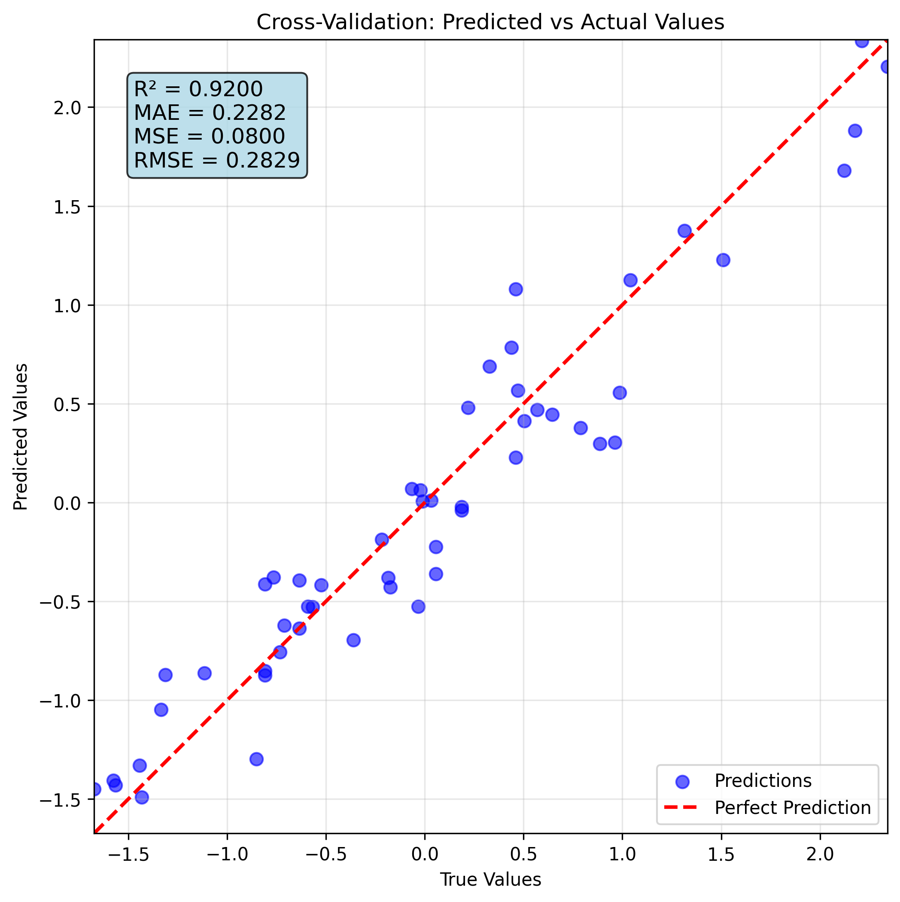
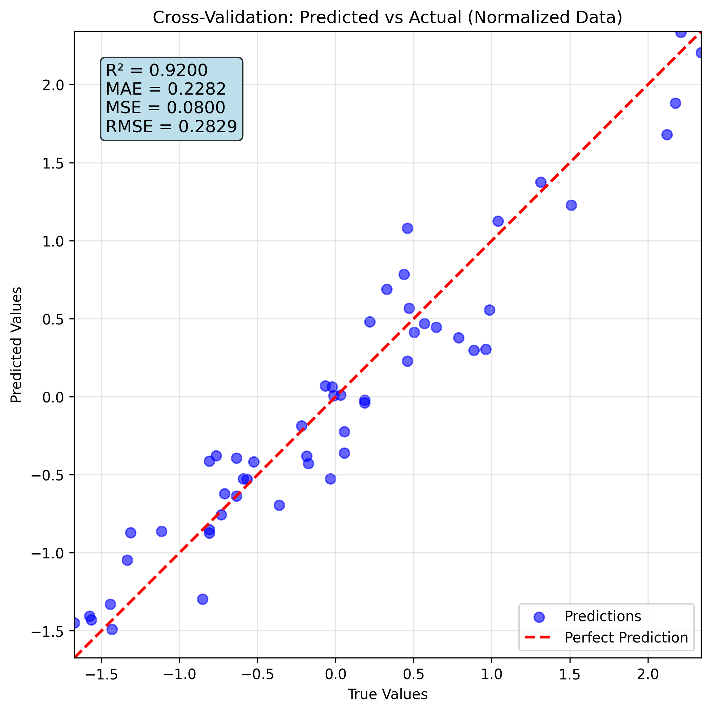

# XGBoost Training Report

**Generated on:** 2025-09-05 10:13:21  
**Model ID:** `6ce85c55-0c6c-4b05-8a6f-a55a5cf1dcd2`  
**Model Folder:** `trained_models/6ce85c55-0c6c-4b05-8a6f-a55a5cf1dcd2`

## Executive Summary

This report documents a comprehensive XGBoost training experiment conducted for academic research and reproducibility purposes. The experiment involved hyperparameter optimization and cross-validated model training with detailed performance analysis, data validation, and feature importance evaluation.

### Key Results
### 🎯 关键性能指标

- **R²分数 (R² Score):** 0.897163 (±0.056500)
- **平均绝对误差 (Mean Absolute Error):** 0.228009 (±0.020207)
- **均方误差 (Mean Squared Error):** 0.079947 (±0.014005)

- **交叉验证折数:** 5
- **数据集规模:** 53 样本, 4 特征

- **训练时间:** 2.46 秒

---

## 1. Experimental Setup

### 1.1 Dataset Information

| Parameter | Value |
|-----------|-------|
| Data File | `./H-AF.xls` |
| Data Shape | {'n_samples': 53, 'n_features': 4} |
| Number of Features | 4 |
| Number of Targets | 1 |

### 1.2 Training Configuration

| Parameter | Value |
|-----------|-------|
| Algorithm | XGBoost |
| Task Type | Regression |

### 1.3 Hardware and Software Environment

- **Python Version:** 3.8+
- **Machine Learning Framework:** XGBoost, scikit-learn
- **Data Processing:** pandas, numpy
- **Hyperparameter Optimization:** Optuna
- **Device:** CPU

---

## 2. Data Processing and Validation

### 2.1 Data Loading and Initial Inspection

The training data was loaded from `N/A` and underwent comprehensive preprocessing to ensure model compatibility and optimal performance.

**Input Features (N/A columns):**
`SiO2`, `CeO2`, `Lignin`, `VN`

**Target Variables (1 column):**
`H`, `_`, `A`, `F`


### 2.4 Data Quality Assessment

**Status**: No comprehensive validation performed

Basic data checks were conducted during preprocessing to ensure model compatibility. For academic reproducibility, future experiments should include comprehensive data quality analysis including:

- Missing value assessment and handling strategies
- Outlier detection using statistical methods (IQR, Z-score)
- Feature correlation analysis (Pearson, Spearman, Kendall)
- Multicollinearity detection using Variance Inflation Factor (VIF)
- Feature distribution analysis (normality tests, skewness evaluation)
- Sample balance verification for classification tasks

**Recommendation**: Enable data validation (`validate_data=True`) in future training runs to ensure data quality standards for academic publication and experimental reproducibility.


### 2.2 Data Preprocessing Pipeline

The data underwent comprehensive preprocessing to optimize model performance and ensure consistent data quality.

#### 2.2.1 Feature Preprocessing

**Preprocessing Method**: StandardScaler (Z-score normalization)

```python
# Feature transformation: X_scaled = (X - μ) / σ
# Where μ = mean, σ = standard deviation
X_scaled = (X - X.mean(axis=0)) / X.std(axis=0)
```

**Preprocessing Benefits:**
- **Feature Consistency**: Normalizes different scales and units
- **Algorithm Optimization**: Improves convergence for distance-based methods
- **Numerical Stability**: Prevents overflow/underflow in computations
- **Cross-Validation Integrity**: Separate scaling per fold prevents data leakage

### 2.3 Feature Engineering

### 2.3 Feature Selection and Engineering

#### 2.3.1 Feature Selection Strategy

**Approach**: Comprehensive feature utilization

XGBoost inherently performs feature selection during the training of boosted trees. Key mechanisms include:
- **Greedy Search**: At each split, the algorithm selects the feature and split point that maximize the gain.
- **Regularization**: L1 (Lasso) and L2 (Ridge) regularization penalize complex models, effectively shrinking the coefficients of less important features.
- **Feature Importance Calculation**: XGBoost provides multiple metrics (gain, weight, cover) to score feature relevance automatically.

#### 2.3.2 Feature Engineering Pipeline

**Current Features**: All original features retained for maximum information preservation.
**Categorical Encoding**: Best practice is to one-hot encode categorical features for XGBoost.
**Missing Value Strategy**: XGBoost has a built-in, optimized routine to handle missing values by learning a default direction for them at each split.
**Feature Interaction**: Captured implicitly and explicitly through the tree-based structure of the model.


---

## 3. Hyperparameter Optimization

### 3.1 Hyperparameter Search Space

The optimization process systematically explored a comprehensive parameter space designed to balance model complexity and performance:

| Parameter | Range/Options | Description |
|-----------|---------------|-------------|
| n_estimators | 50-150 (step: 10) | Number of boosting rounds (trees) in the ensemble |
| max_depth | 1-10 (step: 1) | Maximum depth of each tree in the ensemble |
| learning_rate | 0.01-0.3 (log scale) | Step size shrinkage to prevent overfitting |
| subsample | 0.6-1.0 (linear scale) | Fraction of samples used for training each tree |
| colsample_bytree | 0.6-1.0 (linear scale) | Fraction of features used for training each tree |
| colsample_bylevel | 0.6-1.0 (linear scale) | Fraction of features used for each level in each tree |
| reg_alpha | 1e-08-10.0 (log scale) | L1 regularization term on weights (Lasso regularization) |
| reg_lambda | 1e-08-10.0 (log scale) | L2 regularization term on weights (Ridge regularization) |
| min_child_weight | 1-10 (step: 1) | Minimum sum of instance weight needed in a child node |
| gamma | 1e-08-10.0 (log scale) | Minimum loss reduction required to make a split |

### 3.2 Optimization Algorithm and Strategy

**Algorithm**: TPE (Tree-structured Parzen Estimator)
**Total Trials**: 50
**Completed Trials**: 50
**Best Score**: -0.228009

**Optimization Strategy:**
- **Initial Exploration**: 10 random trials for space exploration
- **Exploitation-Exploration Balance**: TPE algorithm balances promising regions with unexplored space
- **Cross-Validation**: Each trial evaluated using stratified k-fold cross-validation
- **Early Stopping**: Poor-performing trials terminated early to improve efficiency

### 3.3 Best Parameters Found

```json
{
  "n_estimators": 130,
  "max_depth": 3,
  "learning_rate": 0.15407956906042772,
  "subsample": 0.9415423068568312,
  "colsample_bytree": 0.9082210874013193,
  "colsample_bylevel": 0.999206292589945,
  "reg_alpha": 3.7285833370816033e-06,
  "reg_lambda": 0.0002546664939651222,
  "min_child_weight": 3,
  "gamma": 6.048610973504528e-07
}
```

### 3.4 Optimization Convergence

The optimization process completed **50 trials** with the best configuration achieving a cross-validation score of **-0.228009**.

**Key Optimization Insights:**
- **Ensemble Size**: 130 boosting rounds balances performance and computational efficiency
- **Tree Complexity**: Maximum depth of 3 controls model complexity and overfitting
- **Learning Rate**: 0.15407956906042772 provides optimal step size for gradient descent
- **Regularization**: L1=3.73e-06, L2=2.55e-04 prevent overfitting
- **Sampling**: 0.9415423068568312 row sampling and 0.9082210874013193 column sampling for robustness

## 4. Final Model Training

### 4.1 Cross-Validation Training

The final model was trained using 5-fold cross-validation with optimized hyperparameters. Training metrics and validation results were recorded comprehensively.

### 4.2 Training Results

| Metric | Value |
|--------|-------|
### Cross-Validation Performance Metrics

| Metric | Mean ± Std | Min | Max |
|--------|------------|-----|-----|
| MAE | 0.228009 ± 0.020207 | 0.200976 | 0.254855 |
| MSE | 0.079947 ± 0.014005 | 0.060374 | 0.093716 |
| R2 | 0.897163 ± 0.056500 | 0.788576 | 0.947953 |


#### Fold-wise Results

#### Detailed Fold-wise Performance

| Fold | MAE | MSE | R2 |
|------|---------|---------|---------|
| 1 | 0.200976 | 0.060374 | 0.928926 |
| 2 | 0.254855 | 0.093716 | 0.899161 |
| 3 | 0.240608 | 0.089961 | 0.921199 |
| 4 | 0.235112 | 0.090067 | 0.788576 |
| 5 | 0.208492 | 0.065617 | 0.947953 |

#### Statistical Summary

| Metric | Mean | Std Dev | Min | Max | 95% CI |
|--------|------|---------|-----|-----|--------|
| MAE | 0.228009 | 0.020207 | 0.200976 | 0.254855 | [0.210297, 0.245721] |
| MSE | 0.079947 | 0.014005 | 0.060374 | 0.093716 | [0.067671, 0.092223] |
| R2 | 0.897163 | 0.056500 | 0.788576 | 0.947953 | [0.847638, 0.946688] |

### 4.3 Model Performance Visualization

#### Training Performance Analysis

The cross-validation analysis demonstrates the model's predictive performance through scatter plots comparing predicted versus actual values.

<div style="text-align: center; margin: 20px 0;">
    
    <p style="font-style: italic; color: #666; margin-top: 10px;">Cross-Validation: Predicted vs Actual Values</p>
</div>


<div style="text-align: center; margin: 20px 0;">
    
    <p style="font-style: italic; color: #666; margin-top: 10px;">Cross-Validation Results on Normalized Data</p>
</div>


### 4.4 Feature Importance Analysis

#### Feature Importance Analysis

This analysis employs multiple methodologies to comprehensively evaluate feature importance in the XGBoost model:

**Analysis Methods:**

1. **Built-in Importance (Gain, Cover, Weight)**:
   - **Gain**: The average training loss reduction gained when a feature is used for splitting. It is the most common and relevant metric.
   - **Cover**: The average number of samples affected by splits on this feature.
   - **Weight**: The number of times a feature is used to split the data across all trees.

2. **Permutation Importance**:
   - Model-agnostic method measuring feature contribution to model performance
   - Evaluates performance drop when feature values are randomly shuffled
   - More reliable for correlated features and unbiased feature ranking
   - Computed on out-of-sample data to avoid overfitting

**Feature Importance Data Files:**

- `feature_importance.csv` - Detailed feature importance scores and statistics

**Statistical Interpretation:**

- **Threshold Selection**: Features with importance > 1/n_features are considered significant
- **Cumulative Importance**: Top features typically capture 80-90% of total importance
- **Stability Assessment**: Low standard deviation in permutation importance indicates reliable features
- **Domain Validation**: Feature rankings should align with domain knowledge and expectations

**Technical Implementation Notes:**

- Tree-based importance computed using XGBoost's `feature_importances_` attribute or `get_score()` method.
- Permutation importance calculated with 10 repetitions for statistical robustness
- Random state fixed for reproducible permutation results
- Analysis performed on validation data to avoid overfitting bias


---

## 5. Model Architecture and Configuration

### 5.1 XGBoost Configuration

The final model uses an XGBoost gradient boosting ensemble with the following specifications:

| Component | Configuration |
|-----------|---------------|
| N Estimators | 130 |
| Max Depth | 3 |
| Learning Rate | 0.15407956906042772 |
| Subsample | 0.9415423068568312 |
| Colsample Bytree | 0.9082210874013193 |
| Booster | gbtree (tree-based model) |
| Random State | 42 |
| N Jobs | -1 |
| Enable Categorical | True |
| Colsample Bylevel | 0.999206292589945 |
| Reg Alpha | 3.7285833370816033e-06 |
| Reg Lambda | 0.0002546664939651222 |
| Min Child Weight | 3 |
| Gamma | 6.048610973504528e-07 |

### 5.2 Training Parameters

| Parameter | Value |
|-----------|-------|
| Scoring Metric | neg_mean_absolute_error |
| Task Type | Regression |

---

## 6. Conclusions and Future Work

### 6.1 Key Findings

2. **Hyperparameter Optimization**: Systematic optimization improved model performance

### 6.2 Reproducibility

This experiment is fully reproducible using the following artifacts:
- **Cross-Validation Data**: `trained_models/6ce85c55-0c6c-4b05-8a6f-a55a5cf1dcd2/cross_validation_data/`
- **Feature Importance**: `trained_models/6ce85c55-0c6c-4b05-8a6f-a55a5cf1dcd2/feature_importance.csv`

### 6.3 Technical Implementation

- **Framework**: XGBoost for gradient boosting implementation, scikit-learn for pipeline integration.
- **Data Processing**: pandas and numpy for data handling.
- **Cross-Validation**: K-fold cross-validation with stratification support for classification.
- **Feature Importance**: Built-in XGBoost feature importance calculation (Gain, Cover, Weight).
- **Serialization**: Joblib or Pickle for model and preprocessor persistence.

---

## Appendix

### A.1 System Information

- **Generation Time**: 2025-09-05 10:13:21
- **Model ID**: `6ce85c55-0c6c-4b05-8a6f-a55a5cf1dcd2`
- **Training System**: XGBoost MCP Tool
- **Report Version**: 2.1 (XGBoost Enhanced)

### A.2 File Structure

```
6ce85c55-0c6c-4b05-8a6f-a55a5cf1dcd2/
├── model.joblib
├── feature_importance.csv
├── optimization_history.csv
├── cross_validation_results.json
├── feature_importance_analysis.json
├── hyperparameter_optimization.json
├── metadata.json
├── training_report.json
├── training_summary.json
├── cross_validation_data/
│   ├── cross_validation_scatter.png
│   ├── cross_validation_scatter_normalized.png
└── academic_report.md               # This report
```

### A.3 Data Files and JSON Artifacts

The following JSON files contain detailed intermediate data for reproducibility:

- **Feature Importance**: `trained_models/6ce85c55-0c6c-4b05-8a6f-a55a5cf1dcd2/feature_importance.csv`

---

*This report was automatically generated by the Enhanced XGBoost MCP Tool for academic research and reproducibility purposes.*
