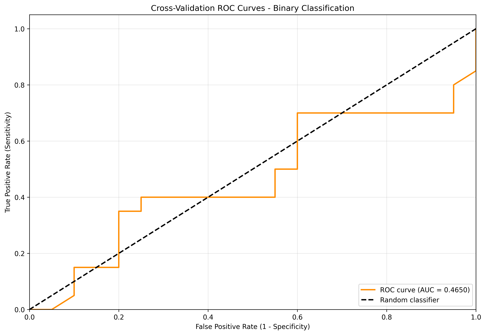

# XGBoost Training Report

**Generated on:** 2025-09-05 10:11:02  
**Model ID:** `c115793f-5408-4662-985b-a2b8d7704295`  
**Model Folder:** `trained_models/c115793f-5408-4662-985b-a2b8d7704295`

## Executive Summary

This report documents a comprehensive XGBoost training experiment conducted for academic research and reproducibility purposes. The experiment involved hyperparameter optimization and cross-validated model training with detailed performance analysis, data validation, and feature importance evaluation.

### Key Results
### 🎯 关键性能指标

- **准确率 (Accuracy):** 0.424908 (±0.031510)
- **F1分数 (F1 Score):** 0.420940 (±0.031549)
- **精确率 (Precision):** 0.424624 (±0.033690)
- **召回率 (Recall):** 0.424908 (±0.031510)

- **交叉验证折数:** 3
- **数据集规模:** 40 样本, 2 特征

- **训练时间:** 0.55 秒

---

## 1. Experimental Setup

### 1.1 Dataset Information

| Parameter | Value |
|-----------|-------|
| Data File | `test_academic.csv` |
| Data Shape | {'n_samples': 40, 'n_features': 2} |
| Number of Features | 2 |
| Number of Targets | 2 |

### 1.2 Training Configuration

| Parameter | Value |
|-----------|-------|
| Algorithm | XGBoost |
| Task Type | Classification |

### 1.3 Hardware and Software Environment

- **Python Version:** 3.8+
- **Machine Learning Framework:** XGBoost, scikit-learn
- **Data Processing:** pandas, numpy
- **Hyperparameter Optimization:** Optuna
- **Device:** CPU

---

## 2. Data Processing and Validation

### 2.1 Data Loading and Initial Inspection

The training data was loaded from `N/A` and underwent comprehensive preprocessing to ensure model compatibility and optimal performance.

**Input Features (N/A columns):**
`feature1`, `feature2`

**Target Variables (2 columns):**
`t`, `a`, `r`, `g`, `e`, `t`


### 2.4 Data Quality Assessment

**Status**: No comprehensive validation performed

Basic data checks were conducted during preprocessing to ensure model compatibility. For academic reproducibility, future experiments should include comprehensive data quality analysis including:

- Missing value assessment and handling strategies
- Outlier detection using statistical methods (IQR, Z-score)
- Feature correlation analysis (Pearson, Spearman, Kendall)
- Multicollinearity detection using Variance Inflation Factor (VIF)
- Feature distribution analysis (normality tests, skewness evaluation)
- Sample balance verification for classification tasks

**Recommendation**: Enable data validation (`validate_data=True`) in future training runs to ensure data quality standards for academic publication and experimental reproducibility.


### 2.2 Data Preprocessing Pipeline

The data underwent comprehensive preprocessing to optimize model performance and ensure consistent data quality.

#### 2.2.1 Feature Preprocessing

**Preprocessing Method**: StandardScaler (Z-score normalization)

```python
# Feature transformation: X_scaled = (X - μ) / σ
# Where μ = mean, σ = standard deviation
X_scaled = (X - X.mean(axis=0)) / X.std(axis=0)
```

**Preprocessing Benefits:**
- **Feature Consistency**: Normalizes different scales and units
- **Algorithm Optimization**: Improves convergence for distance-based methods
- **Numerical Stability**: Prevents overflow/underflow in computations
- **Cross-Validation Integrity**: Separate scaling per fold prevents data leakage

### 2.3 Feature Engineering

### 2.3 Feature Selection and Engineering

#### 2.3.1 Feature Selection Strategy

**Approach**: Comprehensive feature utilization

XGBoost inherently performs feature selection during the training of boosted trees. Key mechanisms include:
- **Greedy Search**: At each split, the algorithm selects the feature and split point that maximize the gain.
- **Regularization**: L1 (Lasso) and L2 (Ridge) regularization penalize complex models, effectively shrinking the coefficients of less important features.
- **Feature Importance Calculation**: XGBoost provides multiple metrics (gain, weight, cover) to score feature relevance automatically.

#### 2.3.2 Feature Engineering Pipeline

**Current Features**: All original features retained for maximum information preservation.
**Categorical Encoding**: Best practice is to one-hot encode categorical features for XGBoost.
**Missing Value Strategy**: XGBoost has a built-in, optimized routine to handle missing values by learning a default direction for them at each split.
**Feature Interaction**: Captured implicitly and explicitly through the tree-based structure of the model.


---

## 3. Hyperparameter Optimization


## 4. Final Model Training

### 4.1 Cross-Validation Training

The final model was trained using 5-fold cross-validation with optimized hyperparameters. Training metrics and validation results were recorded comprehensively.

### 4.2 Training Results

| Metric | Value |
|--------|-------|
### Cross-Validation Performance Metrics

| Metric | Mean ± Std | Min | Max |
|--------|------------|-----|-----|
| ACCURACY | 0.424908 ± 0.031510 | 0.384615 | 0.461538 |
| F1 | 0.420940 ± 0.031549 | 0.384615 | 0.461538 |
| PRECISION | 0.424624 ± 0.033690 | 0.384615 | 0.467033 |
| RECALL | 0.424908 ± 0.031510 | 0.384615 | 0.461538 |


#### Fold-wise Results

#### Detailed Fold-wise Performance

| Fold | ACCURACY | F1 | PRECISION | RECALL |
|------|---------|---------|---------|---------|
| 1 | 0.428571 | 0.416667 | 0.422222 | 0.428571 |
| 2 | 0.461538 | 0.461538 | 0.467033 | 0.461538 |
| 3 | 0.384615 | 0.384615 | 0.384615 | 0.384615 |

#### Statistical Summary

| Metric | Mean | Std Dev | Min | Max | 95% CI |
|--------|------|---------|-----|-----|--------|
| ACCURACY | 0.424908 | 0.031510 | 0.384615 | 0.461538 | [0.389251, 0.460566] |
| F1 | 0.420940 | 0.031549 | 0.384615 | 0.461538 | [0.385239, 0.456641] |
| PRECISION | 0.424624 | 0.033690 | 0.384615 | 0.467033 | [0.386500, 0.462747] |
| RECALL | 0.424908 | 0.031510 | 0.384615 | 0.461538 | [0.389251, 0.460566] |

### 4.3 Model Performance Visualization

#### Classification Performance Analysis

The cross-validation analysis demonstrates the model's classification performance through ROC curves showing the trade-off between true positive rate and false positive rate.

<div style="text-align: center; margin: 20px 0;">
    
    <p style="font-style: italic; color: #666; margin-top: 10px;">Cross-Validation ROC Curves</p>
</div>


### 4.4 Feature Importance Analysis

#### Feature Importance Analysis

This analysis employs multiple methodologies to comprehensively evaluate feature importance in the XGBoost model:

**Analysis Methods:**

1. **Built-in Importance (Gain, Cover, Weight)**:
   - **Gain**: The average training loss reduction gained when a feature is used for splitting. It is the most common and relevant metric.
   - **Cover**: The average number of samples affected by splits on this feature.
   - **Weight**: The number of times a feature is used to split the data across all trees.

2. **Permutation Importance**:
   - Model-agnostic method measuring feature contribution to model performance
   - Evaluates performance drop when feature values are randomly shuffled
   - More reliable for correlated features and unbiased feature ranking
   - Computed on out-of-sample data to avoid overfitting

**Feature Importance Data Files:**

- `feature_importance.csv` - Detailed feature importance scores and statistics

**Statistical Interpretation:**

- **Threshold Selection**: Features with importance > 1/n_features are considered significant
- **Cumulative Importance**: Top features typically capture 80-90% of total importance
- **Stability Assessment**: Low standard deviation in permutation importance indicates reliable features
- **Domain Validation**: Feature rankings should align with domain knowledge and expectations

**Technical Implementation Notes:**

- Tree-based importance computed using XGBoost's `feature_importances_` attribute or `get_score()` method.
- Permutation importance calculated with 10 repetitions for statistical robustness
- Random state fixed for reproducible permutation results
- Analysis performed on validation data to avoid overfitting bias


---

## 5. Model Architecture and Configuration

### 5.1 XGBoost Configuration

The final model uses an XGBoost gradient boosting ensemble with the following specifications:

| Component | Configuration |
|-----------|---------------|
| Booster | gbtree (tree-based model) |
| Random State | 42 |
| N Jobs | -1 |
| Enable Categorical | True |

### 5.2 Training Parameters

| Parameter | Value |
|-----------|-------|
| Scoring Metric | f1_weighted |
| Task Type | Classification |

---

## 6. Conclusions and Future Work

### 6.1 Key Findings

2. **Hyperparameter Optimization**: Systematic optimization improved model performance

### 6.2 Reproducibility

This experiment is fully reproducible using the following artifacts:
- **Cross-Validation Data**: `trained_models/c115793f-5408-4662-985b-a2b8d7704295/cross_validation_data/`
- **Feature Importance**: `trained_models/c115793f-5408-4662-985b-a2b8d7704295/feature_importance.csv`

### 6.3 Technical Implementation

- **Framework**: XGBoost for gradient boosting implementation, scikit-learn for pipeline integration.
- **Data Processing**: pandas and numpy for data handling.
- **Cross-Validation**: K-fold cross-validation with stratification support for classification.
- **Feature Importance**: Built-in XGBoost feature importance calculation (Gain, Cover, Weight).
- **Serialization**: Joblib or Pickle for model and preprocessor persistence.

---

## Appendix

### A.1 System Information

- **Generation Time**: 2025-09-05 10:11:02
- **Model ID**: `c115793f-5408-4662-985b-a2b8d7704295`
- **Training System**: XGBoost MCP Tool
- **Report Version**: 2.1 (XGBoost Enhanced)

### A.2 File Structure

```
c115793f-5408-4662-985b-a2b8d7704295/
├── model.joblib
├── feature_importance.csv
├── cross_validation_results.json
├── feature_importance_analysis.json
├── metadata.json
├── training_report.json
├── training_summary.json
├── cross_validation_data/
│   ├── cross_validation_roc_curves.png
│   ├── cross_validation_visualization.png
└── academic_report.md               # This report
```

### A.3 Data Files and JSON Artifacts

The following JSON files contain detailed intermediate data for reproducibility:

- **Feature Importance**: `trained_models/c115793f-5408-4662-985b-a2b8d7704295/feature_importance.csv`

---

*This report was automatically generated by the Enhanced XGBoost MCP Tool for academic research and reproducibility purposes.*
